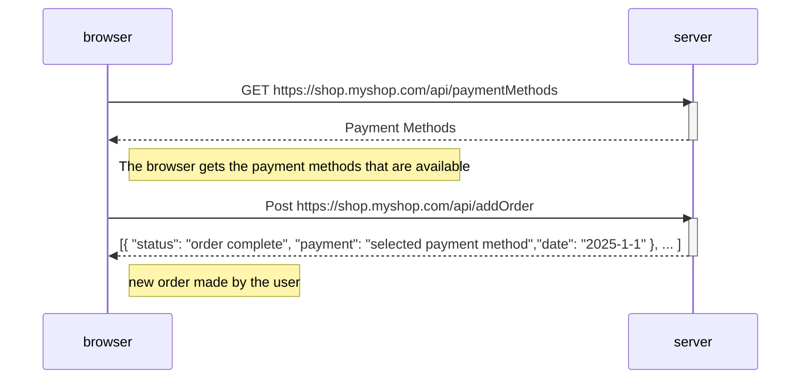

```mermaid
sequenceDiagram
participant browser
participant server

    browser->>server: GET https://shop.myshop.com/api/paymentMethods
    activate server
    server-->>browser: Payment Methods
    deactivate server

    Note right of browser: The browser gets the payment methods that are available

    browser->>server: Post https://shop.myshop.com/api/addOrder
    activate server
    server-->>browser: [{ "status": "order complete", "payment": "selected payment method","date": "2025-1-1" }, ... ]
    deactivate server

    Note right of browser: new order made by the user
```